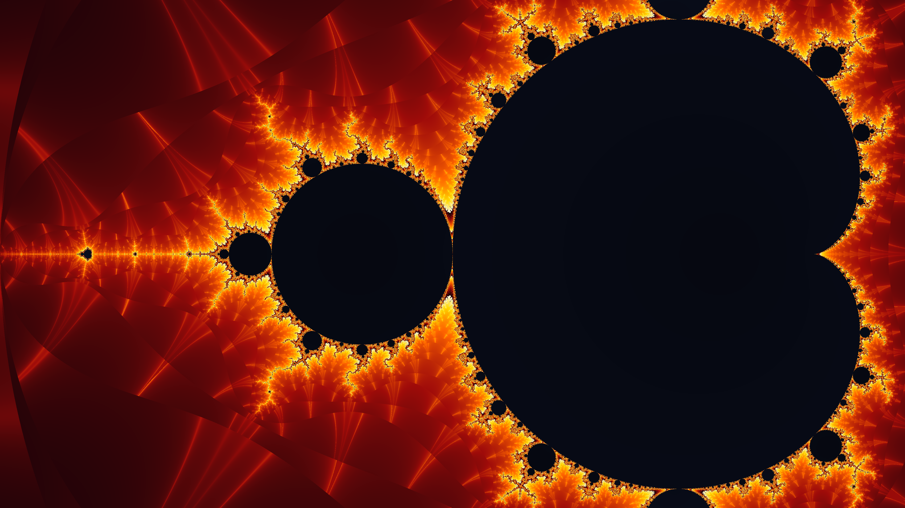

# High-Performance GPU Mandelbrot & Julia Set Inspector V3

A production-grade, open-source GPU-accelerated Mandelbrot and Julia Set renderer written in Python with Numba CUDA. Designed for real-time fractal exploration, hardware benchmarking, double-precision stress testing, interactive Julia parameter inspection, and automated 4K asset rendering on NVIDIA GPUs (e.g. RTX 5050 / RTX 30xx / 40xx series).

---

## 📷 Screenshot Gallery

| Cyberpunk Neon Palette (4K) | Fire / Magma Palette (4K) | Emerald Forest Palette (4K) |
|---|---|---|
|  |  |  |

---

## ✨ Version 3 Key Features

1. **Integrated Floating GUI Control Panel (`gui.py`)**:
   - Collapsible glassmorphic control panel with interactive UI widgets:
     - **Sliders**: Max Iterations (200 – 50,000), Color Phase Shift (0.0 – 1.0), and Render Target Scale (0.25x – 1.0x).
     - **Dropdowns**: Color Palette Selection (*Cyberpunk Neon, Deep Space, Fire/Magma, Emerald Forest, Monochrome Synth*) and Precision Mode (*FP32 vs FP64*).
     - **Action Buttons**: *Toggle Julia Inspector*, *Toggle Stress Benchmark*, *Record MP4 Video*, and *Reset Camera View*.

2. **Interactive Julia Set Inspector (`[J]`)**:
   - Split-screen real-time mode rendering the Mandelbrot set on the left and the corresponding Julia Set $z_{n+1} = z_n^2 + c$ on the right.
   - Click or hover anywhere on the Mandelbrot view to dynamically inspect the corresponding Julia parameter $c = r + i\cdot i$ in real time via synchronized CUDA kernels.

3. **Automated CLI Benchmark Suite (`--benchmark`)**:
   - Run `python main.py --benchmark` to launch a headless 50-frame compute stress test across 4 resolutions (720p, 1080p, 1440p, 4K) and FP32/FP64 precision modes.
   - Automatically generates a formatted report table in `BENCHMARK_RESULTS.md` with:
     - **Avg FPS**, **Min Frame Latency (ms)**, **Throughput (MP/s)**, and **GFLOPS**.

4. **Automated 4K README Asset Generator (`--generate-readme-assets`)**:
   - Run `python main.py --generate-readme-assets` or `python utils.py --generate-readme-assets` to batch-render 3 ultra-high-res 4K (3840x2160) PNG screenshots into the `docs/` directory.

5. **Smooth Continuous Coloring & Animated Flow**:
   - Kernel-level continuous log-smoothing for exterior escaped points and smooth interior potential Shading for non-escaped points.
   - Linear interpolation LUT lookup with continuous phase shifting to eliminate harsh color banding.

6. **Trajectory Auto-Zoom & MP4 Video Export (`[P]` & `[R]`)**:
   - Automated smooth infinite camera auto-zoom into Minibrot coordinates (`-0.743643887`, `0.131825904`).
   - 10-second high-FPS MP4 video recording export powered by `imageio` and `OpenCV`.

---

## 🛠️ Project Structure
```text
GPU_MR/
├── main.py              # CLI entrypoint, PyGame app lifecycle, split-screen renderer, HUD & events
├── mandelbrot_kernel.py # Numba CUDA kernels (f32/f64) for Mandelbrot & Julia set with CPU fallbacks
├── gui.py               # Lightweight PyGame GUI panel framework (Sliders, Dropdowns, Buttons)
├── utils.py             # Palette manager (5 LUTs), 100-frame FPS tracker, CLI benchmark & asset generator
├── check_gpu.py         # Hardware diagnostic tool for CUDA devices, PyTorch, & CuPy
├── requirements.txt     # Dependencies list (numpy, pygame-ce, numba, pillow, imageio, imageio-ffmpeg, opencv-python)
├── docs/                # Generated 4K screenshot assets for README documentation
│   ├── mandelbrot_cyberpunk_4k.png
│   ├── mandelbrot_fire_4k.png
│   └── mandelbrot_emerald_4k.png
├── BENCHMARK_RESULTS.md # Auto-generated compute benchmark results table
├── LICENSE              # MIT License file
└── README.md            # Comprehensive project documentation
```

---

## 🚀 Quick Setup & Usage

### 1. System Requirements
- Python 3.10+
- NVIDIA Graphics Card with CUDA Drivers
- Windows / Linux OS

### 2. Clone the Repository
```bash
git clone https://github.com/Aaryan89/Mandelbrot-Set-GPU.git
cd Mandelbrot-Set-GPU
```

### 3. Install Dependencies
```bash
pip install -r requirements.txt
```

### 4. Verify CUDA Hardware Detection
```bash
python check_gpu.py
```

### 5. Launch Interactive Renderer GUI
```bash
python main.py
```

### 6. Run Automated CLI Compute Benchmark Suite
```bash
python main.py --benchmark
```

### 7. Generate 4K README Screenshot Assets
```bash
python main.py --generate-readme-assets
```

---

## 🎮 Controls Reference

| Control / Key | Action |
|---|---|
| **[J]** | Toggle **Julia Set Split-Screen Inspector** |
| **Mouse Click (Left Half)** | Set Julia Set parameter $c = r + i\cdot i$ on Mandelbrot view |
| **[C]** | Cycle color palettes (*Cyberpunk, Deep Space, Fire, Emerald, Monochrome*) |
| **[1] – [5]** | Jump directly to specific color palette 1 through 5 |
| **[B]** | Toggle **Stress Benchmark Mode** (10,000 Iterations, FP64, Native Scale) |
| **[P]** | Toggle **Automated Camera Trajectory Auto-Zoom** to Minibrot coordinates |
| **[R]** or **[REC]** | Start / Stop **10-Second High-FPS MP4 Video Recording** |
| **[SPACE]** | Toggle **Precision Mode** (`FP32` Single Precision vs `FP64` Double Precision) |
| **[H]** | Toggle control hints overlay |
| **[HOME] / [BACKSPACE]** | Reset camera view bounds |
| **[UP] / [DOWN]** | Increase / Decrease max iterations (+100 / -100) |
| **Mouse Wheel** | Cursor-anchored smooth zoom in / out |
| **Left Click + Drag** | Pan across complex plane |
| **[ESC]** | Quit application |

---

## 📄 License

This project is licensed under the MIT License. See the [LICENSE](LICENSE) file for details.
